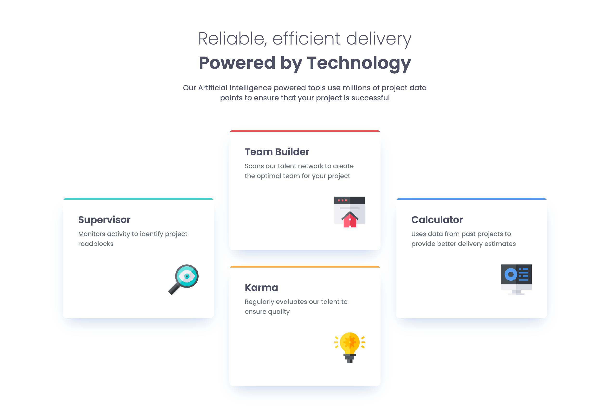

# Frontend-Mentor-Project-06-Four-Card-Feature-Section

This is a solution to the [Four Card Feature Section challenge on Frontend Mentor](https://www.frontendmentor.io/challenges/product-preview-card-component-GO7UmttRfa). Frontend Mentor challenges help you improve your coding skills by building realistic projects. 

## Table of contents

- [Overview](#overview)
  - [The challenge](#the-challenge)
  - [Screenshot](#screenshot)
- [My process](#my-process)
  - [Built with](#built-with)
  - [What I learned](#what-i-learned)
  - [Continued development](#continued-development)
- [Author](#author)
- [Acknowledgments](#acknowledgments)

## Overview

This is my first foray into using grids, so that will be fun to explore. Far more typically have used flex boxes. Goal is to work from mobile design outwards into tablet design and then into desktop. Interestingly, the challenge comes with grid design, and it shifts layout between all three and changes child positioning. 

### Screenshot

<!--  -->

## My process

I will be starting with a mobile-first approach to this project and build out the mobile design before shifting to accomodate the desktop view. Preceded this build with some studying on grid properties, and I have an idea in mind of how I plan to approach this. Once again I will be leveraging clamped fonts. 

I was exploring using `font` shorthand in CSS, but I sense that I am already running into issues as we use responsive design. I am not certain that I will retain this shorthand for the final version, but we chasll see.

### Built with

- Semantic HTML5 markup
- CSS custom properties
- Flexbox
- Grid

### What I learned

Lots of grid exploration; online resources are just wonderful for that and it clarified frustration I had previously with them. The detail that measuring in frames versus pixels or rems was critical. 
Additionally, I can see why people use Sass every time these css sheets start to get bulky. SOOOON...

### Continued development

11/7/25: Odds and ends for mobile need to be changed. Will add font resizing for mobile soon as well. Immediate focus is tweaks to make the larger formats shift.

## Author

- Frontend Mentor - [@MalakDynamics](https://www.frontendmentor.io/profile/MalakDynamics)

## Acknowledgments

Thanks to Frontend Mentor for all the assets and practice projects!